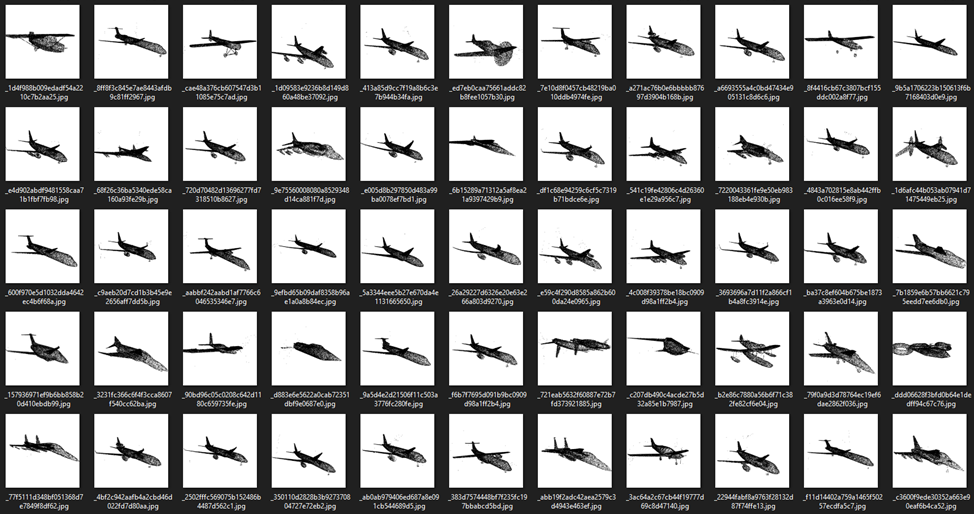
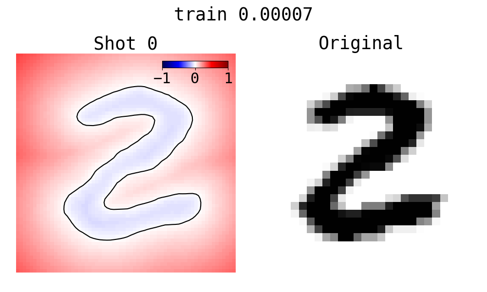
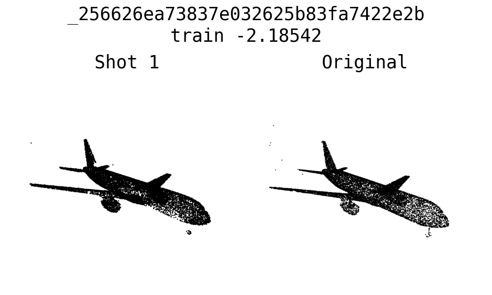
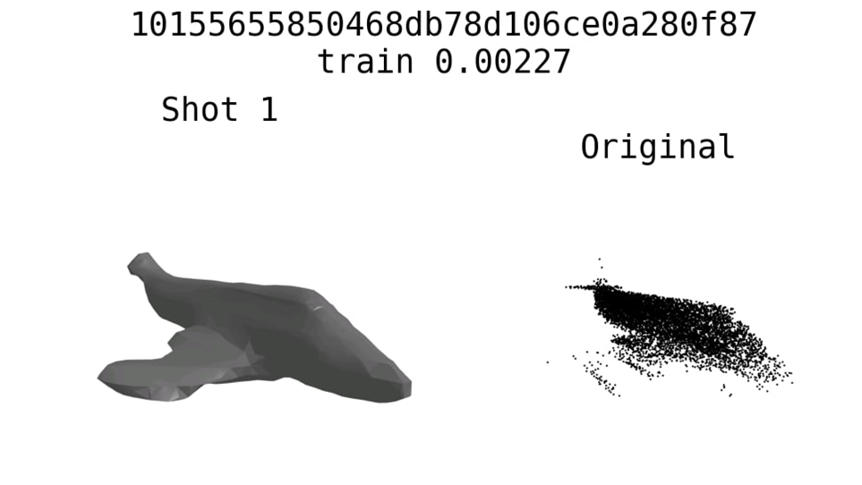
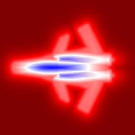
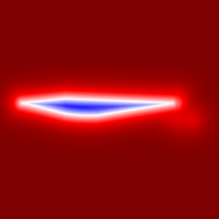

# Signed Distance Field

### Preprocessed ShapeNet aircraft:

### Hypernetwork on MNIST:

### Meta Learning on ShapeNet:

### Ground true SDF slices (secret ZibraAI technique):

## Known issues
Some ShapeNet points have wrong distance signs due to their tiny or wrong-directed normals.